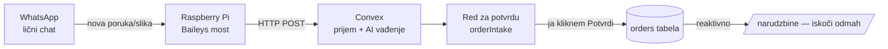

# WhatsApp → Porudžbine: Plan sistema

*Automatsko vađenje porudžbina iz jednog WhatsApp chata u `alati` (Next.js 16 + Convex).*

---

## 1. Cilj

Sistem koji „sluša" jedan moj WhatsApp chat i, čim se pojavi porudžbina (tekst **ili** skrinšot), izvuče podatke o kupcu, sredi adresu po mom pravilu, prepozna da li je **slanje** ili **lično preuzimanje**, primeni podrazumevana podešavanja (kurir, račun), i ubaci porudžbinu u tabelu — uz moj klik **Potvrdi** kao poslednji korak.

Ključno: već imam skoro sve delove u bazi (`orders`, `customers`, `shippingAccounts`, `inboxImages`). Ovo je **automatski dovod** iznad postojećeg sistema, ne gradnja od nule.

---

## 2. Arhitektura (4 karike)



1. **Raspberry Pi = uši.** Mali servis (Baileys) stalno zakačen na WhatsApp kao „povezani uređaj". Hvata svaku novu poruku i prosleđuje je Convex-u.
2. **Convex = prijem + mozak.** Primi poruku, pozove cloud AI (vision) da izvuče podatke, i upiše ih u **red za potvrdu**.
3. **Red za potvrdu = sigurnosna mreža.** Vidim izvučene podatke + original, kliknem Potvrdi (ili ispravim).
4. **orders tabela = kraj.** Potvrđena porudžbina pada u `orders` (stage `poruceno`) i odmah iskoči u `/narudzbine` jer je Convex reaktivan.

> **Zašto Pi, a ne Vercel/Convex za most?** Vercel i Convex su serverless — gase se kad nema saobraćaja i ne mogu da drže stalnu WhatsApp konekciju. Pi je non-stop upaljen, malo struje, idealan za ovo.

---

## 3. Hardver — šta kupiti (~€120, jednokratno)

| Stavka | Okvirno | Napomena |
|---|---|---|
| **Raspberry Pi 5, 8GB** | €80–90 | „Kupi i zaboravi"; 4GB bi stigao ali 8GB je siguran |
| **Zvanično 27W USB-C napajanje** | €12 | Pi 5 traži baš ovo, ne bilo koji punjač |
| **microSD 64GB A2** (SanDisk Extreme / Samsung) | €12 | Kasnije lako nadogradnja na SSD |
| **Zvanični Active Cooler** (ventilator+hladnjak) | €7 | Obavezno za 24/7 rad |
| **Kućište za Pi 5** | €10 | Koje prima active cooler |
| Mrežni kabl | — | Preporuka žična veza (pouzdanije od WiFi-a) |

Ne treba monitor ni tastatura — setup je „headless" preko mog PC-a.

---

## 4. Softverske komponente

**A. Pi most** (novi mali repo, Node.js)
- `Baileys` biblioteka — konekcija ka WhatsApp-u kao povezani uređaj (QR skeniram jednom).
- Sluša samo **jedan određeni chat** (po ID-ju).
- Za svaku novu poruku šalje `POST` na Convex HTTP endpoint: tekst + (ako ima) sliku + `messageId` + vreme.
- Radi kao `systemd` servis → sam se diže na reboot, sam restartuje ako padne.

**B. Convex** (u postojećem `alati` projektu)
- Novi `http.ts` endpoint `POST /whatsapp/incoming` — prima poruke sa Pi-a.
- Nova tabela `orderIntake` — red za potvrdu (draft porudžbine).
- Nova tabela `automationSettings` — podrazumevana podešavanja (kurir, račun...).
- Nova **action** `extractOrder` — poziva cloud vision model, vraća strukturisan JSON.

**C. Frontend** (Next.js)
- Nova strana `/narudzbine/prijem` — red za potvrdu: kartice sa slikom/tekstom + izvučenim poljima, dugmad **Potvrdi / Ispravi / Odbaci**.
- Nova strana `/podesavanja` (ili sekcija) — biram podrazumevani račun, kurir, scope; menjam globalno kad hoću.

---

## 5. Model podataka (Convex)

### Nova tabela `orderIntake` (red za potvrdu)
```
orderIntake:
  scope            "default" | "kalaba"
  whatsappMessageId string        // dedup — da ne uđe dvaput
  receivedAt        number
  rawText           string?       // tekst poruke ako postoji
  imageStorageId    _storage?     // skrinšot ako postoji
  // izvučeno od AI:
  customerName      string?
  phone             string?
  address           string?       // već sređena po pravilu
  pickup            boolean
  confidence        number        // 0–1, koliko je AI siguran
  needsReview       boolean       // true ako nešto nije jasno
  status            "pending" | "confirmed" | "rejected"
  createdOrderId    orders?        // veza kad se potvrdi
```

### Nova tabela `automationSettings` (podešavanja koja menjam)
```
automationSettings:
  scope             "default" | "kalaba"
  defaultCourier    "Aks"         // AKS po defaultu za slanje
  defaultAccountId  shippingAccounts   // na čiji račun (slanjeOwner)
  aiProvider        "gemini" | "openai"
  watchedChatId     string        // koji WhatsApp chat slušamo
  updatedAt         number
```

### Postojeće tabele — koristimo kakve jesu
- **`orders`** — cilj upisa. Već ima `customerName`, `address`, `phone`, `pickup`, `slanjeMode` (Posta/Aks/Bex), `slanjeOwner`. Nova porudžbina ide sa `stage: "poruceno"`.
- **`customers`** — po telefonu prepoznajemo postojećeg kupca (već imaš `by_user_scope_phone` indeks).
- **`shippingAccounts`** — spisak računa za izbor u podešavanjima.
- **`inboxImages`** — postojeći obrazac za slike u Convex storage-u koristimo kao uzor.

---

## 6. Pravila (biznis logika)

### Adresa — format za slanje
Cilj (ispravi ako grešim):

> `Ulica broj_kuće, poštanski_broj Zaseok Mesto`
> — a ako nema zaseoka: `Ulica broj_kuće, poštanski_broj Mesto`

AI prepoznaje delove **bez obzira kojim su redom napisani** i složi ih tačno ovako. (Npr. ako kupac napiše „Mesto, ulica 5, 11000" → sredi u `Ulica 5, 11000 Mesto`.)

### Slanje vs lično preuzimanje
- **Lično preuzimanje** (čekirano „lično preuzimanje" / skrinšot ima samo telefon) → `pickup = true`, upisuje se **samo broj telefona**.
- **Slanje** (pun skrinšot ili poruka sa imenom+telefonom+adresom) → `pickup = false`, puni podaci.

### Podrazumevano (menjam globalno u podešavanjima)
- Kad je **slanje** → `slanjeMode = "Aks"` (AKS po defaultu).
- `slanjeOwner` = izabrani račun iz `automationSettings.defaultAccountId`.
- Promenim račun jednom → svaka nova porudžbina od tog trenutka ide na novi. Stare ostaju kakve jesu.

---

## 7. AI mozak (cloud vision)

- **Provajder:** Google **Gemini Flash** (primarni izbor — najjeftiniji, jak OCR, velikodušan besplatan nivo). Alternativa: OpenAI `gpt-4o-mini`. Ključ čuvamo u postojećoj `secrets` tabeli.
- **Tok:** Convex action `extractOrder` dobije sliku/tekst → pošalje modelu **strog prompt** → dobije nazad JSON: `{ customerName, phone, address, pickup, confidence, needsReview, napomena }`.
- **Prompt zadaje:** tačan format adrese (gore), pickup pravilo, i da model **prijavi šta nije siguran** (umesto da nagađa) → to podiže `needsReview`.
- **Cena:** frakcija centa po slici → realno **~€0–3 mesečno** i za stotine porudžbina.

---

## 8. Pouzdanost (da ne promašimo nijednu porudžbinu)

- **Dedup:** `whatsappMessageId` je jedinstven → ista poruka ne može dvaput.
- **Pi kao servis:** `systemd` restart na pad; Baileys po ponovnom povezivanju **sinhronizuje propuštene poruke**.
- **AI padne?** Poruka ostaje u redu kao `needsReview` (ništa se ne gubi, rešim ručno).
- **Sve prolazi kroz red za potvrdu** → nijedan pogrešan podatak ne uđe u `orders` bez mog klika. **To su tvojih 100%.**

---

## 9. Kako izgleda u praksi

1. Kupac pošalje skrinšot porudžbine u chat.
2. Za par sekundi u `/narudzbine/prijem` iskoči kartica: slika + izvučeno ime, telefon, adresa (sređena), oznaka slanje/lično.
3. Pogledam. Ako je sve tačno → **Potvrdi**. Ako fali/pogrešno → ispravim pa Potvrdi.
4. Porudžbina uđe u `orders`: `stage = poruceno`, `slanjeMode = Aks`, `slanjeOwner = moj izabrani račun` — i odmah je vidim u `/narudzbine`.

---

## 10. Faze gradnje (redosled)

| Faza | Šta | Rezultat |
|---|---|---|
| **0. Podešavanja** | `automationSettings` tabela + `/podesavanja` UI | Biram račun/kurir; defaults rade |
| **1. Prijem** | `orderIntake` tabela + HTTP endpoint + `/narudzbine/prijem` UI | Testiram ručnim POST-om — kartica iskoči |
| **2. AI mozak** | `extractOrder` action + prompt | Testiram na mojim pravim skrinšotovima |
| **3. Pi most** | Kupovina + setup + Baileys + `systemd` | Chat se sluša uživo |
| **4. Spajanje** | Sve zajedno + fino štelovanje prompta | Radi u produkciji |

Gradimo fazu po fazu — svaka je upotrebljiva i testirana pre sledeće.

---

## 11. Šta mi treba od tebe (usput)

- **API ključ** za Gemini (napravim nalog kad stignemo do Faze 2 — besplatan nivo je dovoljan za start).
- **Par pravih primera** poruka i skrinšotova — i za slanje i za lično preuzimanje — da naštelujem prompt na tvom stvarnom formatu.
- Kad stigne Pi: ~30 min zajedno za setup (vodim korak po korak).

---

## 12. Troškovi (rekapitulacija)

- **Jednokratno:** Raspberry Pi komplet ~**€120**.
- **Mesečno:** cloud AI ~**€0–3**. Convex/Vercel — na postojećim planovima koje već koristiš.

---

## Rizici i napomene

- **Neslužbeni most** (Baileys) je protiv WhatsApp pravila → postoji **mali rizik bana broja**. Preporuka: koristiti **poseban/rezervni broj** za posao ako je moguće, da glavni broj ne bude izložen.
- Kvalitet vađenja zavisi od čitljivosti skrinšotova — zato red za potvrdu ostaje trajno, ne samo na startu.
